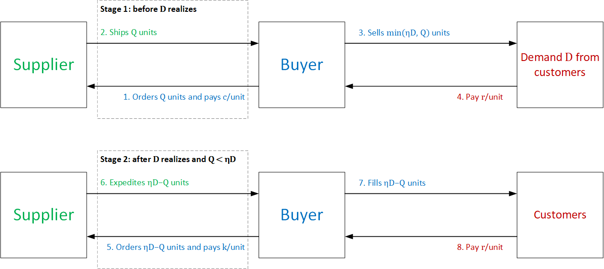

# Expedited shipping

In this repo we provide (i) a brief description of the research setting of this project, the laboratory (lab) experiment we designed to test it and (ii) a Jupyter notebook with the statistical and econometric analyses reported in the paper. However, we don't offer any interpretation of the results since the paper is under evaluation. We briefly comment the results from the robustness checks to highlight the stability of our results.

## Getting started

Please make sure to install Python and the project requirements. The requirements are listed in the file `requirements.txt` and can be installed in a Linux terminal with the following command:[^1]

[^1]: Note the `python -m` at the beggining of the command. While running `pip` this way inside a virtual environment is not necessary, it's good practice to run it this way. See [Why you should use `python -m pip`](https://snarky.ca/why-you-should-use-python-m-pip/) for an explanation about running `pip` with and without `python -m`.

```bash
python -m pip install -r requirements.txt
```

You can do the same with the file `dev-requirements.txt`. This file lists some linting and code formatting libraries that can be used with a source-code editor like VS Code.

## Project description

In this project we examine behavioral regularities of ordering decisions when there's an expedited shipping option.

### Setting

We consider a supplier-buyer channel where the buyer must decide how many units $Q$ to order from her supplier to satisfy a fraction $η$ of her customer demand $D$, *i.e.*, the buyer commits to a target fill rate $η$. She must make her ordering decision before she knows for certain how many units her customers will demand. The buyer can buy the product from her supplier during two different stages. In the first stage, before knowing $D$, she buys $Q$ units from her supplier at unit cost $c$ and obtains revenue $r > c$ for every unit sold. In the second stage, if $Q < ηD$, she expedites the number of units short of $ηD$ from her supplier to guarantee the target fill rate $η$. The unit cost for these expedited units, or expediting cost, is $k \ge c$. These units are also sold at unit price $r$. Note that if $Q \ge ηD$, the channel operates with no second stage. Figure 1 below summarizes the described supplier-buyer channel.

<p style="line-height:0.5" align="center">
    
</p>
<p style="line-height:0.5" align="center"><b>Figure 1.</b> Supplier-buyer channel with expedited shipping.</p>

### Lab experiment

We designed a lab experiment to test the normative predictions of this supplier-buyer channel. The normative model builds on the well-known newsvendor model (Arrow *et al.*, 1951) to explore how optimal orders change with the target fill rate, the expediting cost and the newsvendor model's critical ratio ($CR$) reference.

In each round of the experiment, a participant assuming the buyer role decides the number of units she wishes to buy from a fictitious supplier to satisfy her customer demand while guaranteeing a target fill rate. Her goal is to maximize the profit she makes over several rounds of play.

We set the target fill rate at one (*i.e.*, $η = 1$) to simplify decision-making. In addition, during the experiment, the computer automatically executed the second decision stage when applicable. That is, if a participant’s ordering decision $Q$ failed to meet the target fill rate (*i.e.*, 100% of $D$), the computer automatically expedited the remaining $D − Q$ units at unit expediting cost $k$.

For the experiment, we set $r = \$12$ and $c = \$3$. We explore participants’ ordering decisions under five different expediting costs $k$: $\$4$, $\$6$, $\$12$, $\$18$ and $\$30$. We call it the **Main Experiment**. Behavioral predictions for this experiment are based on the profitability of the expediting stage and related literature (*e.g.*, Ho *et al.*, 2010; Li & Chen, 2020; Katok & Villa, 2022) and how expedited shipping relates to the pull-to-center effect (*e.g.*, Schweitzer & Cachon, 2000; Bolton & Katok, 2008).

In addition, we designed a behavioral intervention based on mental accounting and regret aversion to prompt some specific ordering behavior. The intervention separated the financial results from regular and expedited orders into separate accounts (mental accounting) and highlighted forgone profits from expedited orders, if any (regret aversion). We call it the **Salience Experiment**. Behavioral predictions for this experiment are based on how salience relates to expedited shipping and related literature (*e.g.*, Ho *et al.*, 2010; Becker-Peth *et al.*, 2013; Chen *et al.*, 2013).

### Analysis

#### Dashboard

In the folder **PowerBI** you can find the source file of a dashboard that provides basic information about the experiment. We provide the number of participants per treatment, some basic demographic information about participants and plots with the average ordering behavior over rounds and over participants. We provide two slicers to filter these plots by experiment and expediting cost.

#### Statistics and econometrics

In the folder **Python** you can find the notebook with *Python* code to run the statistical and econometric analyses we report in the paper. The notebook also provides *Stata* code for some of the analyses (this is also provided in a `.do` file).

## Credits

**Authors:** Sebastián Villa, Jaime Andrés Castañeda and Gloria Urrea.

**Funding:** The Universidad del Rosario's Small Grants, grant no. IV-FPF001, partially supported this work.

**Repo admin:** Jaime Andrés Castañeda.

I highly appreciate feedback and you can reach out to me on [LinkedIn](https://bit.ly/jaime-linkedin) any time. I'm also working on other projects. Check this out in my [personal website](https://bit.ly/jaime-website).

Thanks for reading!

## References

Arrow, K. J., Harris, T., & Marschak, J. (1951). Optimal inventory policy. *Econometrica, 19*(3), 250–272.

Becker-Peth, M., Katok, E., & Thonemann, U. W. (2013). Designing buyback contracts for irrational but predictable newsvendors. *Management Science, 59*(8), 1800–1816.

Bolton, G. E., & Katok, E. (2008). Learning by doing in the newsvendor problem: A laboratory investigation of the role of experience and feedback. *Manufacturing and Service Operations Management, 10*(3), 519–538.

Chen, L., Kök, A. G., & Tong, J. D. (2013). The effect of payment schemes on inventory decisions: The role of mental accounting. *Management Science, 59*(2), 436–451.

Ho, T. H., Lim, N., & Cui, T. H. (2010). Reference dependence in multilocation newsvendor models: A structural analysis. *Management Science, 56*(11), 1891–1910.

Katok, E., & Villa, S. (2022). Centralized or decentralized transfer prices: A behavioral approach for improving supply chain coordination. *Manufacturing & Service Operations Management, 24*(1), 143–158.

Li, S., & Chen, K. Y. (2020). The commitment conundrum of inventory sharing. *Production and Operations Management, 29*(2), 353–370.

Schweitzer, M. E., & Cachon, G. P. (2000). Decision bias in the newsvendor problem with a known demand distribution: Experimental evidence. *Management Science, 46*(3) 404–420.
