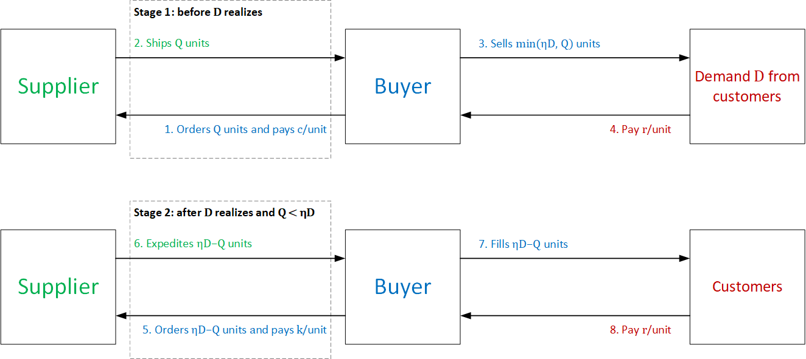

# expedited shipping

## Introduction

In this project, we examine behavioral regularities of ordering decisions when there is an expedited shipping option.

We consider a supplier-buyer channel where the buyer must decide how many units $Q$ to order from her supplier to satisfy a fraction $η$ of her customer demand $D$, i.e., the buyer commits to a target fill rate $η$. She must make her ordering decision before she knows for certain how many units her customers will demand. The buyer can buy the product from her supplier during two different stages. In the first stage, before knowing $D$, she buys $Q$ units from her supplier at unit cost $c$ and obtains revenue $r > c$ for every unit sold. In the second stage, if $Q < ηD$, she expedites the number of units short of $ηD$ from her supplier to guarantee the target fill rate $η$. The unit cost for these expedited units, or expediting cost, is $k ≥ c$. These units are also sold at unit price $r$. Note that if $Q ≥ ηD$, the channel operates with no second stage. Figure 1 below summarizes the described supplier-buyer channel.

	

<b>Figure 1.</b> Supplier-buyer channel with expedited shipping.

We designed a laboratory experiment to test the normative predictions of this supplier-buyer channel. In each round of the experiment, a participant decides the number of units she wishes to buy from a fictitious supplier to satisfy her customer demand while guaranteeing a target fill rate. Her goal is to maximize the profit she makes over several rounds of play.

We set the target fill rate at one (i.e., $η = 1$) to simplify decision-making. In addition, during the experiment, the computer automatically executed the second decision stage where applicable. That is, if a participant’s ordering decision $Q$ failed to meet the target fill rate (i.e., 100% of $D$), the computer automatically expedited the remaining $D − Q$ units at unit expediting cost $k$.

For the experiment, we set $r = \\$12$ and $c = \\$3$. We explore participants’ ordering decisions under five different expediting costs $k$: $\\$4$, \\$6, $\\$12$, $\\$18$ and $\\$30$. In addition, we designed a behavioral intervention based on mental accounting and regret aversion to influence how participants perceive expedited shipping and prompt ordering decisions to counteract its detrimental implications. The intervention separated the financial results from regular and expedited orders into separate accounts (mental accounting) and highlighted forgone profits from expedited orders, if any (regret aversion).

## Analysis 	

The Jupyter notebook and Stata do file we will provide will allow to run the main statistical and econometric analyses we will report in a revision that addresses a Reject & Resubmit decision from an academic journal.

## Credits

**Authors:** Sebastián Villa, Jaime Andrés Castañeda and Gloria Urrea.

**Funding:** Universidad del Rosario, Small Grants research fund, grant number IV-FPF001.